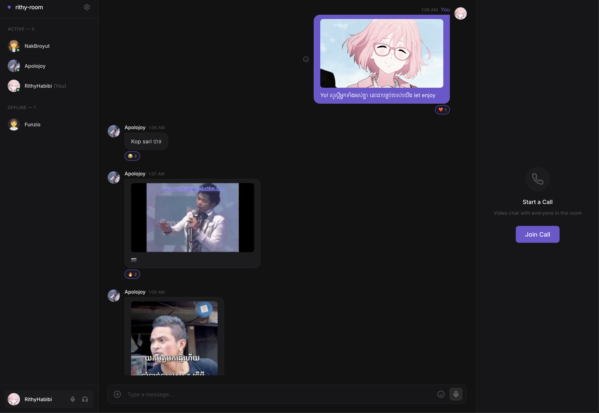

# Rithy Room

A minimalist Discord-lite web app for real-time chat, video calls, and music sync.



## Features

- Create/join rooms with a simple slug (no auth required)
- Real-time text chat with emoji reactions
- Image sharing (upload, paste, drag & drop)
- GIF picker (GIPHY integration)
- Voice messages (hold to record)
- Custom avatar upload
- Member presence (online/offline status)
- WebRTC video/audio calls (peer-to-peer mesh)
- Music sync across all room members
- Dark minimalist UI

## Tech Stack

- **Frontend**: Next.js 15, TypeScript, Tailwind CSS v4, Zustand
- **Backend**: Express, Socket.IO, Prisma, PostgreSQL
- **Storage**: Cloudflare R2 (S3-compatible)
- **Video**: WebRTC (P2P mesh topology)
- **Monorepo**: Turborepo

## Quick Start

### Prerequisites

- Node.js 18+
- npm 10+

### Installation

```bash
# Clone the repo
cd rithy-room

# Install dependencies
npm install

# Setup database
cd apps/server
npx prisma generate
npx prisma db push
cd ../..

# Start development servers
npm run dev
```

This will start:
- Web app: http://localhost:3000
- Server: http://localhost:3001

### Manual Start (if needed)

```bash
# Terminal 1: Start server
cd apps/server
npm run dev

# Terminal 2: Start web
cd apps/web
npm run dev
```

## Project Structure

```
rithy-room/
├── apps/
│   ├── web/                    # Next.js frontend
│   │   ├── app/                # App Router pages
│   │   ├── components/         # React components
│   │   ├── stores/             # Zustand stores
│   │   ├── hooks/              # Custom hooks
│   │   └── lib/                # Utilities
│   │
│   └── server/                 # Express + Socket.IO backend
│       ├── src/
│       │   ├── socket/         # Socket event handlers
│       │   └── db/             # Prisma client
│       └── prisma/             # Database schema
│
├── packages/
│   └── shared/                 # Shared TypeScript types
│
├── turbo.json                  # Turborepo config
└── package.json                # Root workspace config
```

## Environment Variables

### Web (`apps/web/.env.local`)
```
NEXT_PUBLIC_SERVER_URL=http://localhost:3001
NEXT_PUBLIC_GIPHY_API_KEY=your_giphy_api_key
```

### Server (`apps/server/.env`)
```
PORT=3001
CLIENT_URL=http://localhost:3000
DATABASE_URL=postgresql://...

# Cloudflare R2 Storage
R2_ACCOUNT_ID=your_account_id
R2_ACCESS_KEY_ID=your_access_key
R2_SECRET_ACCESS_KEY=your_secret_key
R2_BUCKET_NAME=your_bucket
R2_PUBLIC_URL=https://your-r2-domain.com
```

## Socket Events

### Client → Server
- `create-room` - Create a new room
- `join-room` - Join an existing room
- `send-message` - Send a chat message
- `react-message` - Add emoji reaction
- `update-profile` - Update name/avatar
- `join-call` - Join video call
- `leave-call` - Leave video call
- `webrtc-signal` - WebRTC signaling
- `music-sync` - Sync music state

### Server → Client
- `room-joined` - Initial room data
- `member-joined` - New member notification
- `member-updated` - Profile updated
- `new-message` - New message received
- `reaction-added` - Reaction added
- `presence-update` - Member online/offline
- `webrtc-signal` - WebRTC signaling
- `music-update` - Music state change

## Development

```bash
# Run all apps in dev mode
npm run dev

# Run just the server
cd apps/server && npm run dev

# Run just the web app
cd apps/web && npm run dev

# Open Prisma Studio (database GUI)
cd apps/server && npx prisma studio
```

## Deployment

- **Server**: Railway (with PostgreSQL addon)
- **Web**: Vercel
- **Storage**: Cloudflare R2

## License

MIT
